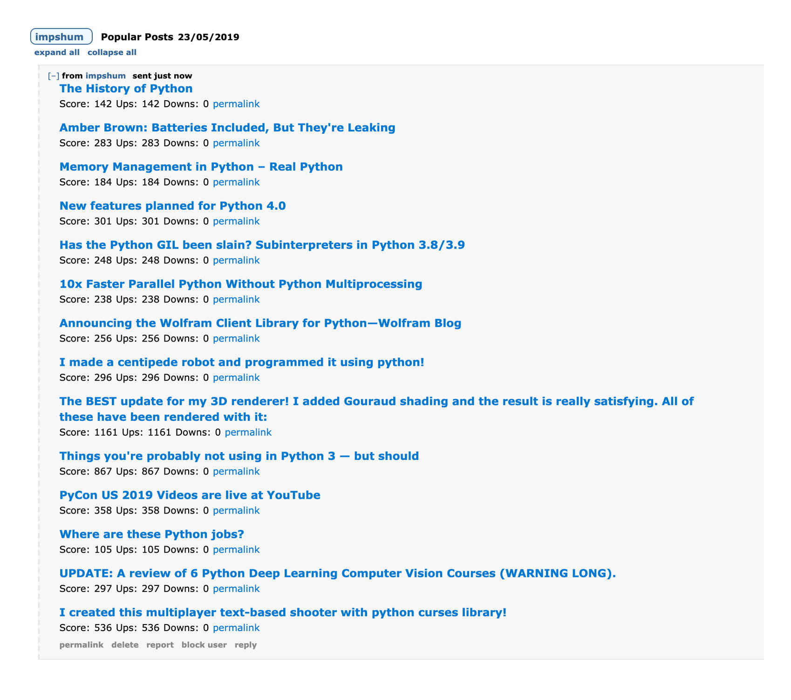

# Reddit Popular Post Notification Bot

Python bot to send notifications of popular submissions



### Requirements

* Python 3
* Pip

### Install dependencies

    pip install -r requirements.txt

### Fill in the blanks     

- Enter all your juicy details into config.ini
- Turn test mode off by changing it's value to 0
- Choose time when bot runs each day
- Multiple subreddits can be chosen like so ```python+learnpython+recycledrobot```

### Run it

    python run.py
